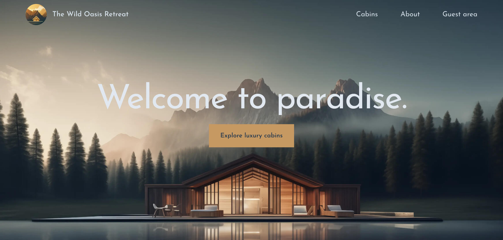
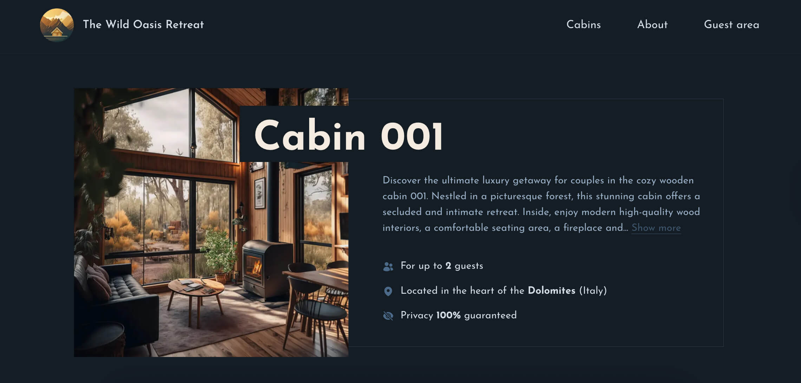
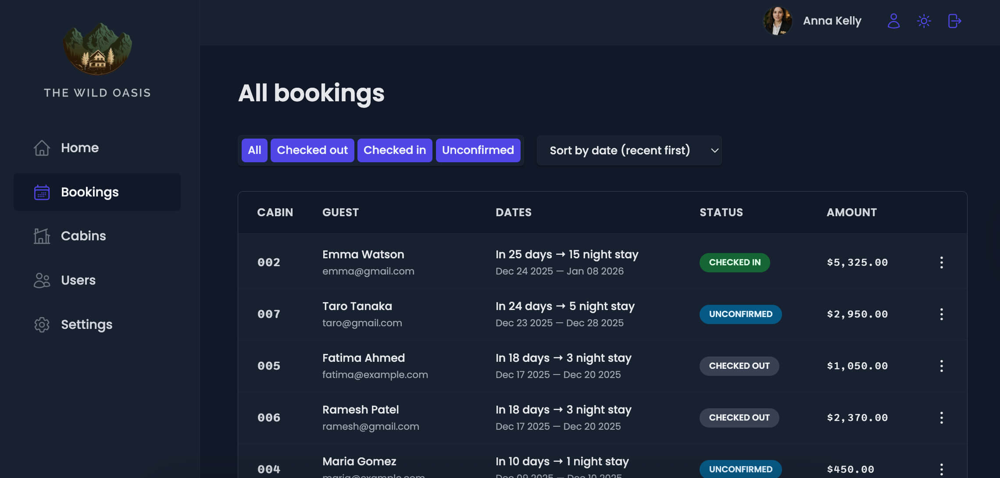
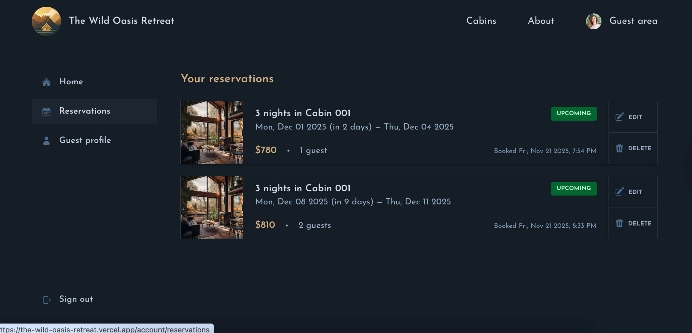
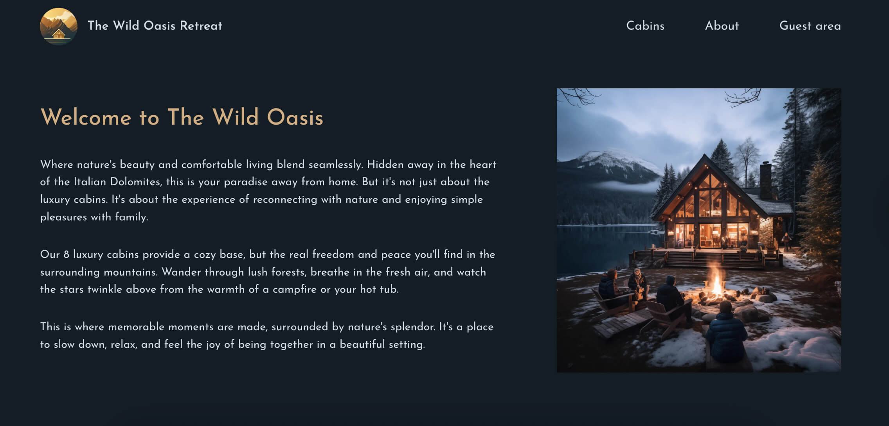

# The Wild Oasis Retreat

Guest-facing booking experience built hands-on while following Jonas Schmedtmann's The Wild Oasis module - and my first deep dive into shipping a full Next.js App Router product. Travelers browse cabins, authenticate with Google, reserve dates, and manage every stay inside their personal guest area.

-  Live demo: [https://the-wild-oasis-retreat.vercel.app](https://the-wild-oasis-retreat.vercel.app)

<p align="center">
  
  
  
  <br />
  
  
  
</p>

## Features ⚙️

-  Marketing site powered by Next.js App Router: hero landing, rich About page, and full cabins catalog rendered as server components with Suspense fallbacks.
-  Cabin listing filters by sleeping capacity, and each cabin detail page is statically generated with dynamic metadata plus live availability fetched from Supabase.
-  Booking experience combines a custom reservation context, `react-day-picker`, and date-fns to prevent double-bookings, show live pricing, and highlight stay length limits.
-  Auth flows rely on NextAuth (Auth.js) with Google Sign-In, middleware-protected `/account/*` routes, and header navigation that adapts based on the current session.
-  Authenticated guests can reserve cabins, get redirected to a thank-you page, view/edit/cancel reservations with optimistically updating lists, and update their profile (nationality + ID validation + country picker backed by REST Countries).
-  Server Actions (`createBooking`, `updateBooking`, `deleteBooking`, `updateGuest`) ensure authorization, mutate Supabase, revalidate paths, and redirect users without client fetch boilerplate.
-  Loading states, streaming sections, and toast-like feedback (`Spinner`, `SpinnerMini`, `useTransition`) make the UX feel instant even when Supabase round-trips take longer.

## Tech Stack 🧩

-  Next.js 16 App Router (server components, route handlers, streaming `loading.js`, dynamic metadata, `generateStaticParams`, middleware).
-  React 19 with `useOptimistic`, `useTransition`, and client/server component mixing.
-  NextAuth (Auth.js) Google provider for authentication + protected routes.
-  Supabase (Postgres + RLS) for cabins, bookings, guests, and settings data.
-  Tailwind CSS 4 with custom design tokens + Josefin Sans, plus Heroicons.
-  React Day Picker, date-fns utilities, and Next/Image for optimized media.

## What I Learned 📚

-  Wiring full-stack App Router flows with server components, Suspense boundaries, and server actions instead of REST endpoints or client-only mutations.
-  Gaining real-world confidence with Next.js (App Router, middleware, NextAuth, server actions) after primarily building React SPAs.
-  Combining NextAuth sessions, middleware, and Supabase row-level security so only the owning guest can update/cancel bookings.
-  Building interactive booking widgets (date range selector, live pricing) that stay in sync across client/server components via a context provider.
-  Using React 19's `useOptimistic`/`useTransition` to keep reservation management snappy while Supabase work happens in the background.
-  Sharing design tokens via Tailwind CSS 4's `@theme` API for consistent brand styling across marketing pages and the guest area.

## Getting Started 🚀

### Prerequisites

-  Node.js 18+
-  npm
-  Supabase project seeded with the course schema (`cabins`, `bookings`, `guests`, `settings`)
-  Google Cloud project with an OAuth client (Client ID/Secret) for NextAuth Google sign-in

### Installation

```bash
git clone https://github.com/ilona-web-dev/the-wild-oasis-retreat.git
cd the-wild-oasis-retreat
npm install
npm run dev
```

1. Create a `.env.local` with:
   ```bash
   SUPABASE_URL=...
   SUPABASE_KEY=...
   NEXTAUTH_URL=http://localhost:3000
   NEXTAUTH_SECRET=...
   AUTH_GOOGLE_ID=...
   AUTH_GOOGLE_SECRET=...
   ```
2. Restart `npm run dev` so Next.js picks up the new environment variables.
3. For production, store the same values as project environment variables on Vercel (or your host).

### Available Scripts

-  `npm run dev` – start Next.js dev server on `http://localhost:3000`.
-  `npm run build` – production build.
-  `npm run start` – run the production server locally.
-  `npm run prod` – build and immediately start.
-  `npm run lint` – run ESLint.

## Project Structure 🗂️

```
src/
├─ app/
│  ├─ _components/     // shared UI, forms, reservation context, buttons
│  ├─ _lib/            // Supabase client, data-service helpers, server actions, auth config
│  ├─ _styles/         // Tailwind globals + design tokens
│  ├─ account/         // protected guest area (home, reservations, profile, edit pages)
│  ├─ cabins/          // listing, dynamic cabin pages, thank-you flow
│  ├─ about/           // marketing story
│  ├─ login/           // Google sign-in entry
│  ├─ api/auth/…       // NextAuth route handler
│  ├─ error.js & loading.js // route-level fallbacks
│  └─ page.js          // landing hero
├─ middleware.js       // guards /account routes with NextAuth middleware
├─ public/             // static imagery (hero background, about photos)
```

## Future Ideas 🔭

-  Add direct payment or deposit capture so guests can prepay instead of paying on arrival.
-  Introduce marketing extras (newsletter signup, testimonials, blog) to improve SEO.
-  Send transactional emails/SMS after booking, cancellation, or profile updates.
-  Localize the UI + currency formatting for international guests.
